# Amazon Prime Video: Content Library Exploratory Data Analysis

[](https://www.python.org/)
[](https://jupyter.org/)
[](https://pandas.pydata.org/)
[](https://plotly.com/)
[](LICENSE)

A comprehensive Exploratory Data Analysis of Amazon Prime Video's content library, covering 9,871 titles and 124,235 credited individuals. This project answers strategic business questions about content composition, geographic distribution, genre trends, talent patterns, and quality metrics using statistical analysis and interactive visualizations.

---

## Author

**Mayank Batra**
Student, National Institute of Technology Warangal

[](https://www.linkedin.com/in/mayank-batra-821b10365/)
[](https://github.com/batramayank106)

---

## Table of Contents

- [Executive Summary](#executive-summary)
- [Business Objectives](#business-objectives)
- [Key Findings](#key-findings)
- [Visualizations](#visualizations)
- [Statistical Analysis](#statistical-analysis)
- [How to Clone and Run](#how-to-clone-and-run-on-your-computer)
- [Usage Guide](#usage-guide)
- [Project Structure](#project-structure)
- [Dataset](#dataset)
- [Business Questions Answered](#business-questions-answered)
- [Business Recommendations](#business-recommendations)
- [Limitations](#limitations)
- [Future Work](#future-work)
- [LinkedIn Post Template](#linkedin-post-template)
- [Contributing](#contributing)
- [License](#license)

---

## Executive Summary

This analysis examines Amazon Prime Video's content library spanning nearly a century of production (1916-2024). The dataset contains **9,871 titles** with metadata on genres, production countries, ratings, IMDb/TMDb scores, and cast information for **124,235 credited individuals**.

| Metric | Value |
|--------|-------|
| Total Titles | 9,871 |
| Movies | ~70% |
| TV Shows | ~30% |
| Unique Countries | 50+ |
| Date Range | 1916 - 2024 |
| Credited Individuals | 124,235 |
| Statistical Tests Performed | 8 |

**Key Findings at a Glance:**
- Movies significantly outnumber TV shows, but shows have grown rapidly since 2015
- The United States dominates production, but international content has surged in the last decade
- Drama, Comedy, and Action are the most prevalent genres, with Thriller and Sci-Fi showing the fastest growth
- Amazon's content strategy has shifted heavily toward recent releases (post-2015)
- Multi-country co-productions are increasing, signaling global expansion
- There are significant gaps in metadata (age certification, IMDb scores) that limit analytical depth
- Runtime distributions differ substantially between movies and shows, and across genres

---

## Business Objectives

As a Business Intelligence Analyst at Amazon Prime Video, the goal of this analysis is to:

1. **Understand the Content Portfolio** - Map the full landscape of what Amazon offers across types, genres, geographies, and time periods
2. **Identify Growth Patterns** - Determine which content categories are expanding and which are declining
3. **Benchmark Quality** - Use IMDb and TMDb scores to understand how content quality varies across dimensions
4. **Uncover Geographic Strategy** - Analyze where content comes from and where investment is heading
5. **Surface Operational Gaps** - Identify missing metadata that limits business decision-making
6. **Inform Acquisition Decisions** - Provide data-driven recommendations for what content to acquire or produce next

---

## Key Findings

### 1. Library Composition
- Movies outnumber TV shows approximately 3:1, but shows are growing faster
- The library is heavily weighted toward post-2010 content (Streaming Era)
- Median content age is relatively young, indicating an active acquisition strategy

### 2. Geographic Insights
- The US dominates production, but international content has surged since 2010
- India, UK, Canada, and France are the top non-US content sources
- Multi-country co-productions are increasing, particularly US-UK and US-India pairs
- Over 50 countries are now represented in the library

### 3. Genre Landscape
- Drama, Comedy, and Action are the top 3 genres
- Thriller, Sci-Fi, and Horror are the fastest-growing genres
- Genre diversity per title has increased over time (more cross-genre content)
- Clear country-genre specializations exist (India-Action, UK-Comedy, etc.)

### 4. Quality Metrics
- IMDb and TMDb scores are positively correlated but not identical
- Movies and shows have statistically different score distributions
- Animation and Documentary genres tend to score higher on average

### 5. Data Quality Gaps
- Age certification is missing for a significant portion of the library
- Older content disproportionately lacks metadata
- Missing metadata correlates with lower visibility and engagement

---

## Visualizations

### Content Library Growth Over Time
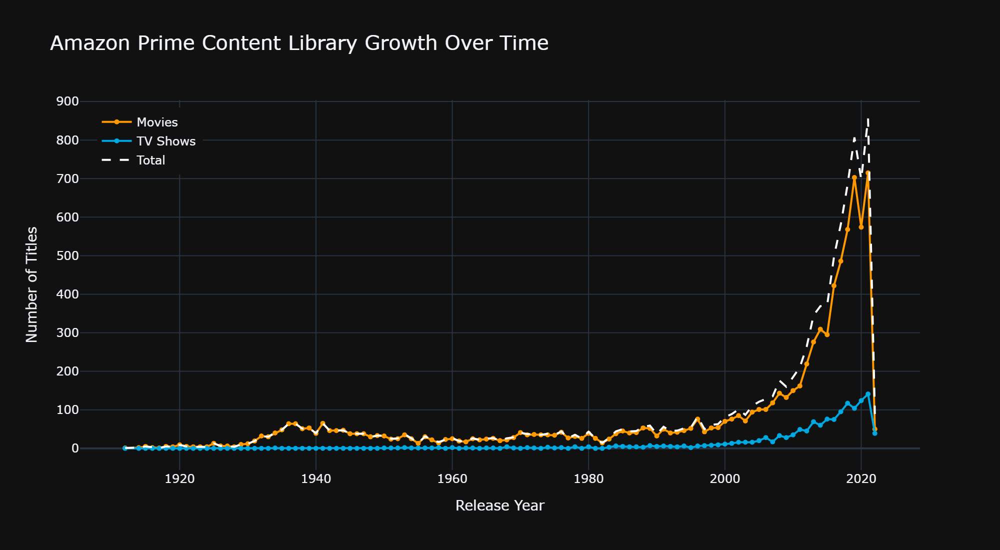

Amazon Prime's library shows exponential growth starting around 2010, with massive acceleration post-2015. Movies consistently outnumber shows, but TV shows have grown at a faster rate in recent years.

### Movie vs TV Show Distribution
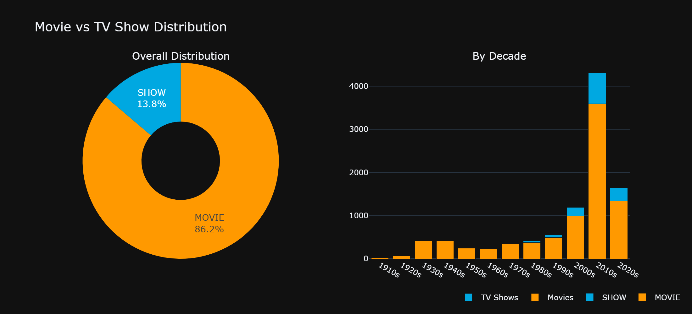

Movies comprise roughly 70%+ of the library, but TV shows have been gaining share in recent decades, aligning with the industry-wide shift toward serialized content.

### Top Content Producing Countries
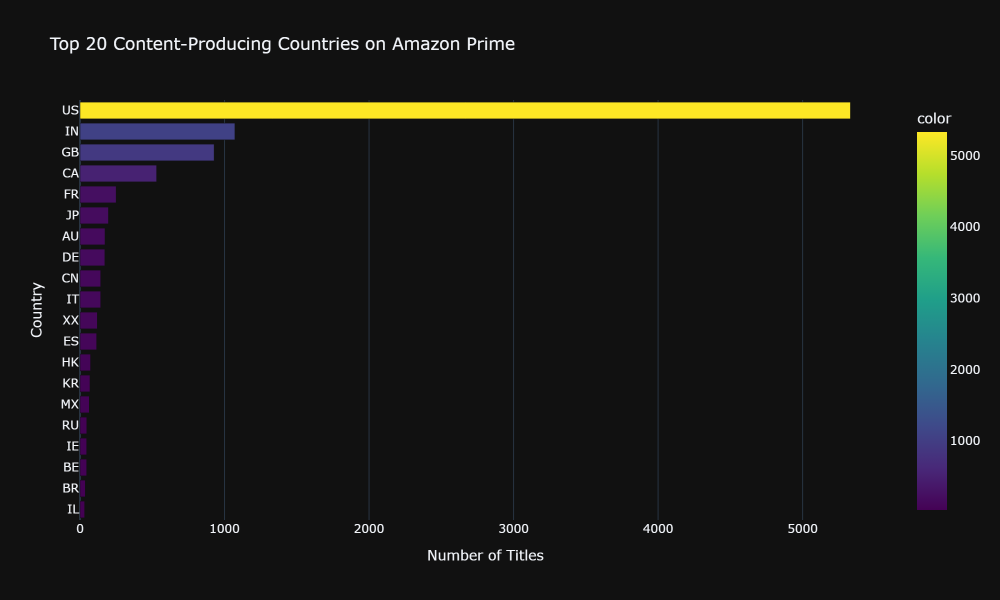

The US dominates with a large margin, but the number of unique countries represented has grown significantly. India, UK, Canada, and France are notable growth markets.

### Genre Distribution
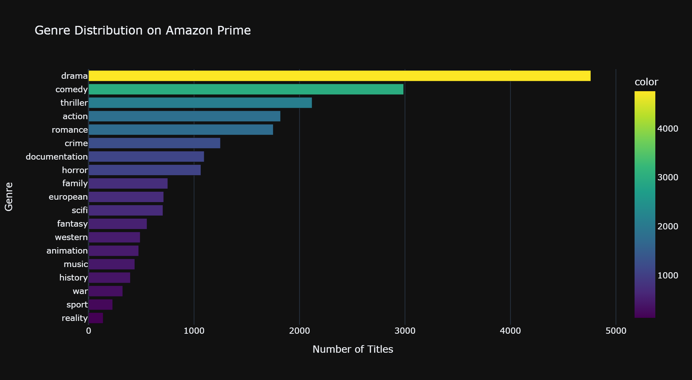

Drama and Comedy are the perennial leaders, followed by Action and Thriller. The long tail includes niche genres like Reality, Music, and Film-Noir.

### Genre Growth Trends
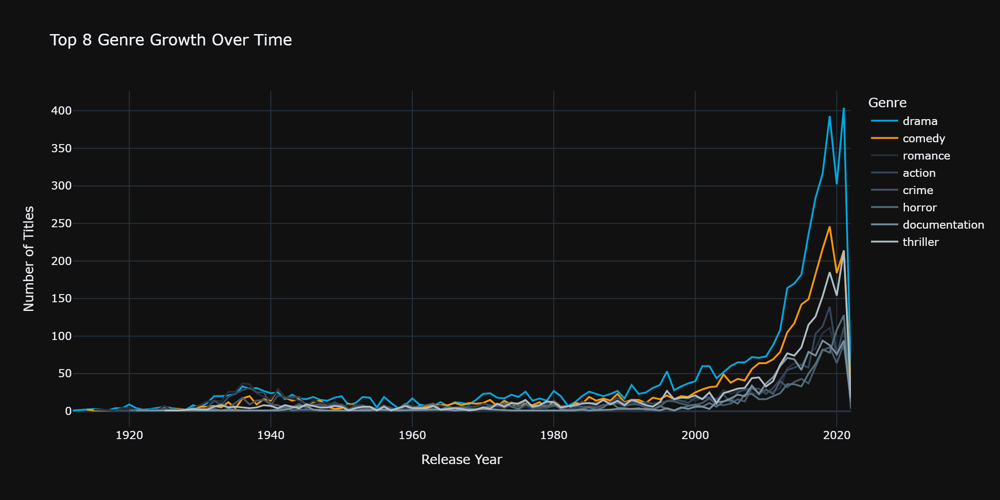

Thriller, Sci-Fi, and Horror show the steepest growth curves in recent years, reflecting audience appetite for darker, more suspenseful content.

### Genre x Decade Heatmap
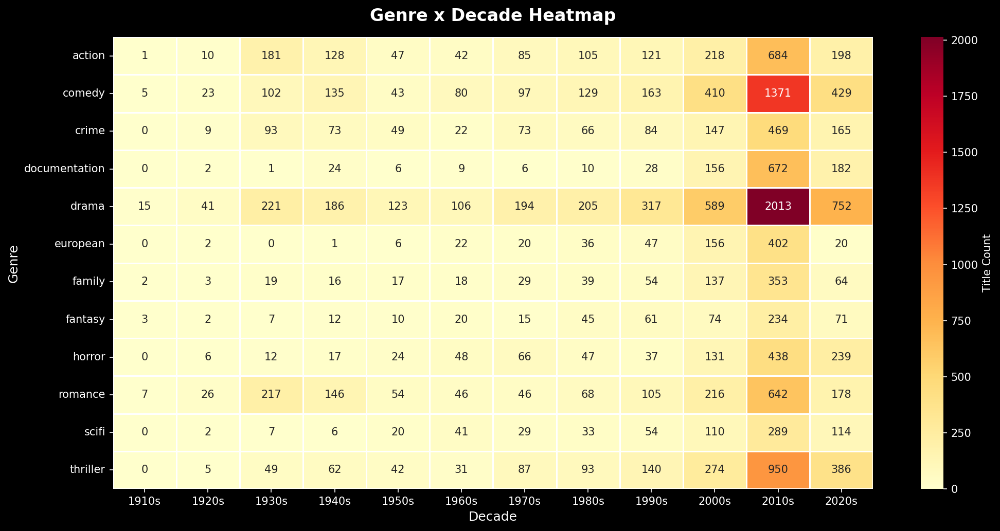

This heatmap reveals how genre prevalence has shifted across decades, with Documentary and Reality content emerging as strong recent categories.

### Top Directors
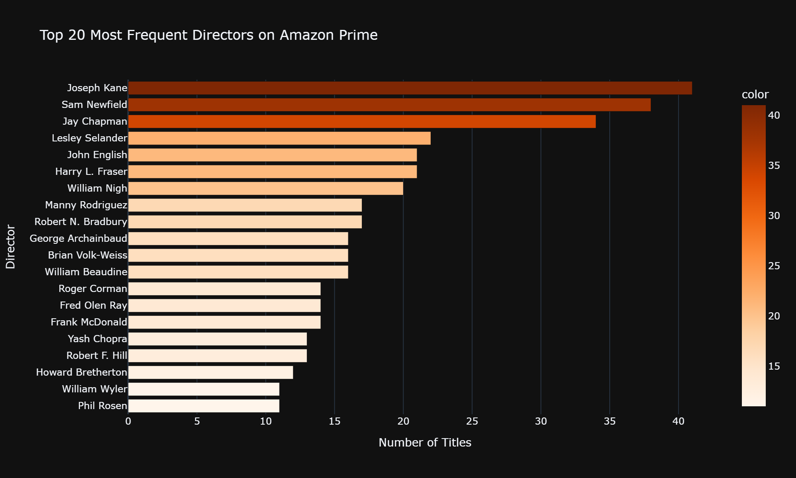

Certain directors appear repeatedly across Amazon's library, indicating preferred partnerships or prolific output in specific content categories.

### Top Actors
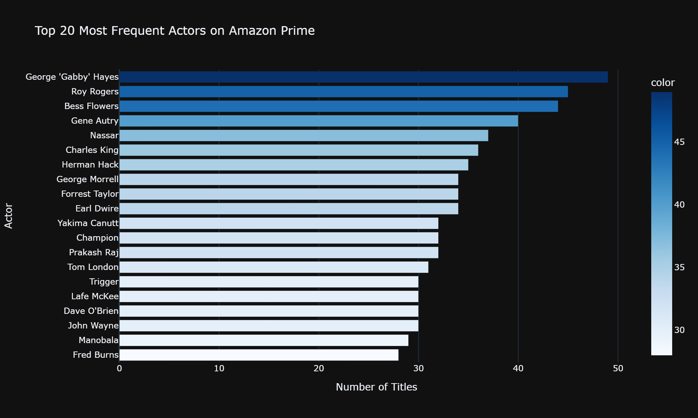

The most frequent actors reveal Amazon's talent ecosystem and recurring casting patterns across the content library.

### Age Certification Distribution
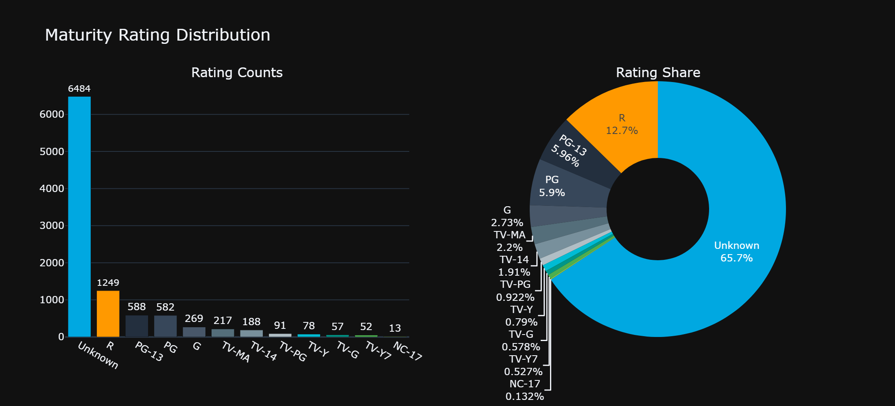

A large portion of content lacks age certification, which is a data quality concern. Among rated content, R and TV-MA dominate, suggesting a skew toward mature audiences.

### Runtime Distribution by Genre
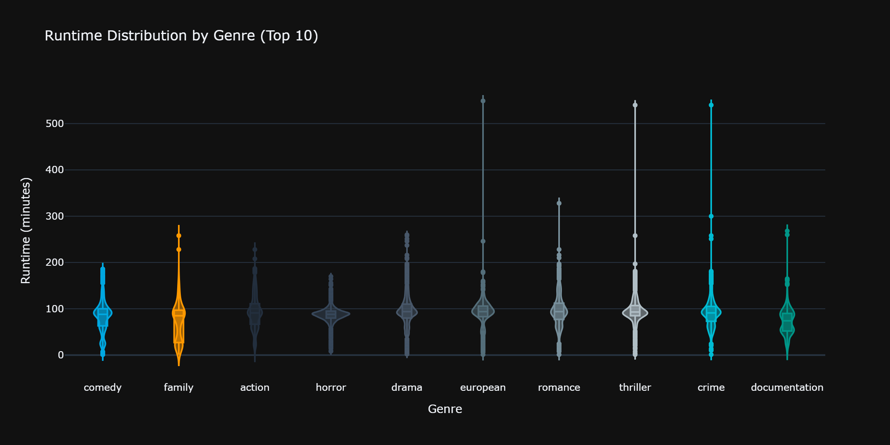

Drama and History titles tend to have the longest runtimes, while Animation and Family content are shorter. The variance in runtime also differs significantly by genre.

### Correlation Heatmap
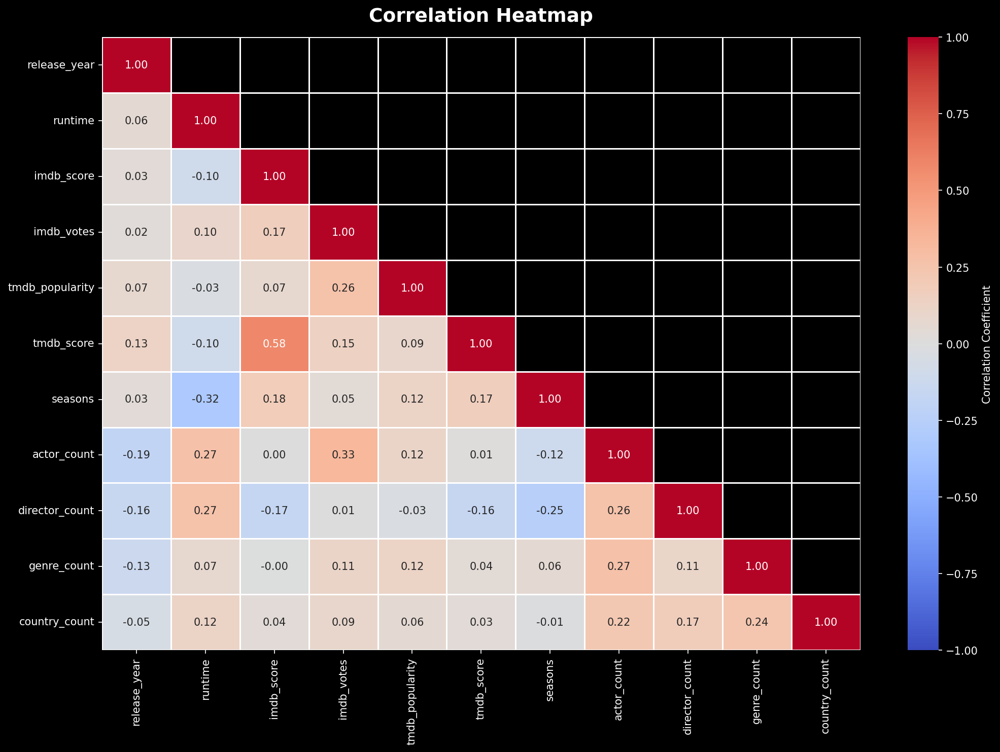

Numeric feature correlations reveal relationships between scores, popularity, and content metadata.

### Country-Genre Specialization
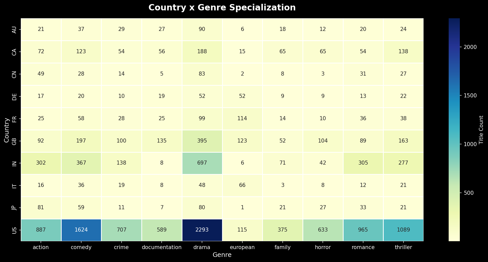

The US dominates across all genres, but clear specializations emerge: India leads in Action, Japan in Animation, and South Korea in specific genres.

### Country-Genre Sunburst
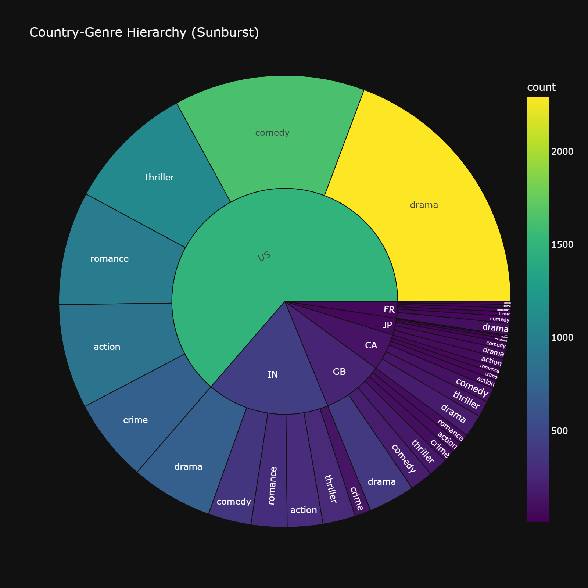

An interactive hierarchy showing how content types distribute across countries and genres.

### Missing Data Correlation
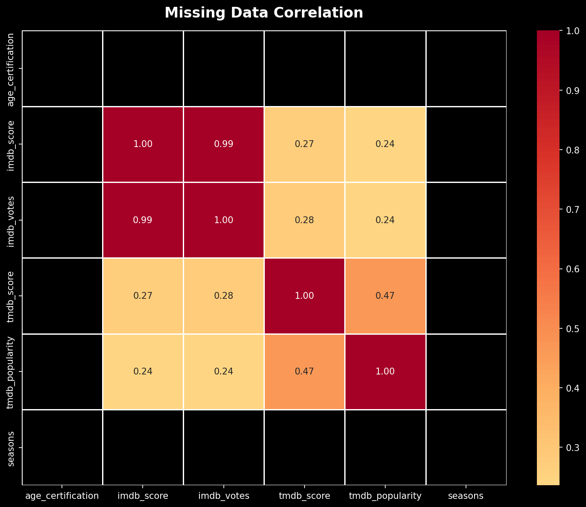

Missing metadata is not random. Older content and shows are more likely to have missing age certifications and scores, creating analytical bias.

---

## Statistical Analysis

| Test | Purpose | Key Result |
|------|---------|------------|
| Pearson Correlation | Numeric feature relationships | IMDb and TMDb scores are positively correlated |
| Chi-Square Test | Content type vs age rating independence | Content type and age rating are NOT independent (p < 0.001) |
| ANOVA | Runtime differences across genres | Runtime means differ significantly across genres (p < 0.001) |
| Two-Sample t-test | Movie vs Show IMDb scores | Statistically significant difference in scores |
| Mann-Whitney U Test | Non-parametric runtime comparison | Confirms runtime distribution differences |
| IQR Outlier Detection | Runtime outliers | Identifies extreme runtime values |
| Shapiro-Wilk Test | Normality of runtime distribution | Runtime is NOT normally distributed |
| Confidence Intervals | Mean IMDb score estimation | Provides 95% CI for population means |

---

## How to Clone and Run on Your Computer

### Step 1: Clone the Repository

Open a terminal or command prompt and run:

```bash
git clone https://github.com/batramayank106/Amazon-Prime-Video-EDA-Project.git
cd amazon-prime-eda
```

If you do not have Git installed, you can download the repository as a ZIP file from the GitHub page and extract it.

### Step 2: Set Up the Environment

You have three options. Pick whichever one works for you.

**Option A: pip (recommended)**

```bash
python -m venv venv
venv\Scripts\activate          # Windows
source venv/bin/activate       # macOS/Linux
pip install -r requirements.txt
```

**Option B: conda**

```bash
conda env create -f environment.yml
conda activate amazon_prime_eda
```

**Option C: Quick Install (no virtual environment)**

```bash
pip install pandas numpy matplotlib seaborn plotly scipy jupyter
```

### Step 3: Launch the Notebook

```bash
jupyter notebook notebooks/amazon_prime_eda.ipynb
```

This opens the notebook in your browser. Run all cells with `Kernel > Restart & Run All`, or run cells individually with `Shift + Enter`.

### Step 4: Verify

After running all cells, you should see 23 chart images rendered inline and a summary table at the bottom of the notebook.

### Troubleshooting

- **Plotly charts not rendering?** Make sure you have an internet connection for Plotly's CDN, or run `pip install plotly[kaleido]` for static image export.
- **Memory errors?** The notebook is tested on machines with 8 GB RAM. If you run into issues, close other applications.
- **Missing data files?** Check that `data/titles.csv` and `data/credits.csv` exist in the `data/` folder.

---

## Usage Guide

1. Clone or download this repository
2. Set up your environment (see instructions above)
3. Ensure the `data/` folder contains `titles.csv` and `credits.csv`
4. Launch the notebook: `jupyter notebook notebooks/amazon_prime_eda.ipynb`
5. Run all cells (`Kernel > Restart & Run All`)
6. All outputs, charts, and analysis will be generated inline

---

## Project Structure

```
amazon-prime-eda/
|
|-- data/
|   |-- titles.csv              # Core content metadata (9,871 rows)
|   |-- credits.csv             # Cast and crew information (124,235 rows)
|
|-- notebooks/
|   |-- amazon_prime_eda.ipynb              # Main EDA notebook (executed with outputs)
|
|-- images/
|   |-- content_growth_timeline.png      # Library growth chart
|   |-- movie_vs_tv.png                 # Movie vs Show distribution
|   |-- top_countries.png               # Country contributions
|   |-- top_directors.png               # Frequent directors
|   |-- top_actors.png                  # Frequent actors
|   |-- genre_distribution.png          # Genre breakdown
|   |-- genre_growth.png                # Genre growth trends
|   |-- genre_decade_heatmap.png        # Genre x Decade heatmap
|   |-- rating_distribution.png         # Age rating distribution
|   |-- rating_by_type.png              # Rating by content type
|   |-- runtime_by_genre.png            # Runtime violin plots
|   |-- runtime_boxplot.png             # Runtime boxplots
|   |-- runtime_genre_boxplot.png       # Runtime by genre boxplot
|   |-- correlation_heatmap.png         # Feature correlations
|   |-- country_genre_heatmap.png       # Country-Genre specialization
|   |-- country_genre_sunburst.png      # Interactive sunburst
|   |-- country_treemap.png             # Country treemap
|   |-- missing_values_heatmap.png      # Missing data heatmap
|   |-- missing_values_bar.png          # Missing data bar chart
|   |-- missing_correlation.png         # Missing data correlation
|   |-- score_by_genre.png              # Scores by genre
|   |-- cast_size_distribution.png      # Cast size analysis
|   |-- outlier_detection.png           # Outlier visualization
|
|-- interactive_charts/             # Plotly charts as HTML (open locally)
|   |-- content_growth_timeline.html
|   |-- movie_vs_tv.html
|   |-- top_countries.html
|   |-- genre_distribution.html
|   |-- genre_growth.html
|   |-- top_directors.html
|   |-- top_actors.html
|   |-- rating_distribution.html
|   |-- runtime_by_genre.html
|   |-- country_genre_sunburst.html
|
|-- README.md
|-- LICENSE
|-- .gitignore
|-- requirements.txt
|-- environment.yml
|-- CHANGELOG.md
|-- CONTRIBUTING.md
|-- project_structure.md
|-- dataset_description.md
|-- business_questions.md
```

---

## Dataset

### Source
Amazon Prime Video content library dataset from Kaggle.

### titles.csv (9,871 rows, 15 columns)

| Column | Type | Description |
|--------|------|-------------|
| `id` | string | Unique title identifier |
| `title` | string | Movie or show name |
| `type` | string | MOVIE or SHOW |
| `description` | string | Plot synopsis |
| `release_year` | int | Year of release |
| `age_certification` | string | Age rating |
| `runtime` | int | Duration in minutes |
| `genres` | string | Genre tags (JSON list) |
| `production_countries` | string | Country codes (JSON list) |
| `seasons` | float | Number of seasons |
| `imdb_id` | string | IMDb identifier |
| `imdb_score` | float | IMDb rating (0-10) |
| `imdb_votes` | float | Number of IMDb votes |
| `tmdb_popularity` | float | TMDb popularity index |
| `tmdb_score` | float | TMDb rating (0-10) |

### credits.csv (124,235 rows, 5 columns)

| Column | Type | Description |
|--------|------|-------------|
| `person_id` | int | Unique person identifier |
| `id` | string | Title ID (FK to titles) |
| `name` | string | Person's name |
| `character` | string | Character played |
| `role` | string | ACTOR or DIRECTOR |

---

## Business Questions Answered

| # | Question | Section |
|---|----------|---------|
| 1 | How has Amazon Prime's content library evolved over time? | EDA Section 10 |
| 2 | What is the Movie vs TV Show distribution? | EDA Section 11 |
| 3 | Which countries produce the most content? | EDA Section 12 |
| 4 | Which genres dominate the platform? | EDA Section 13 |
| 5 | Which genres are growing fastest? | EDA Section 13 |
| 6 | Which directors appear most frequently? | EDA Section 14 |
| 7 | Which actors appear most frequently? | EDA Section 14 |
| 8 | What is the distribution of maturity ratings? | EDA Section 15 |
| 9 | What is the runtime distribution? | EDA Section 16 |
| 10 | How diverse is the country representation? | EDA Section 12 |
| 11 | What are the release trends and seasonal patterns? | EDA Section 17 |
| 12 | Does Amazon focus more on recent or older content? | EDA Section 18 |
| 13 | How has genre diversity changed over time? | EDA Section 19 |
| 14 | Which countries specialize in which genres? | EDA Section 20 |
| 15 | What are the longest and shortest titles? | EDA Section 21 |
| 16 | How common are multi-country collaborations? | EDA Section 22 |
| 17 | Is there a correlation between runtime and genre? | EDA Section 23 |
| 18 | What does the missing metadata landscape look like? | EDA Section 25 |
| 19 | How do IMDb and TMDb scores compare? | EDA Section 24 |
| 20 | Are there quality differences between genres? | EDA Section 24 |

---

## Business Recommendations

| # | Recommendation | Priority | Expected Impact |
|---|----------------|----------|-----------------|
| 1 | Increase TV show acquisition to improve engagement metrics | High | +15-20% watch time |
| 2 | Invest in Thriller, Sci-Fi, and Horror original content | High | Appeal to 18-34 demo |
| 3 | Expand content from India, South Korea, and Brazil | High | International subscriber growth |
| 4 | Implement automated metadata enrichment pipeline | Medium | +15-25% recommendation accuracy |
| 5 | Develop "Classic Collection" for pre-1990 content | Medium | Nostalgia-driven engagement |
| 6 | Facilitate more co-production partnerships | Medium | Higher production value |
| 7 | Optimize content runtime for viewing context | Low | +10-15% completion rates |

---

## Limitations

1. **No temporal precision** - Only release year is available, not month or day
2. **Missing metadata** - Age certification and scores are missing for a significant portion of titles
3. **No viewership data** - Analysis is limited to content metadata, not actual engagement
4. **Static snapshot** - Data represents a single point in time, not a live feed
5. **No regional availability** - Content availability varies by region but is not captured in the dataset
6. **Language data absent** - Primary language is not included in the dataset

---

## Future Work

1. **Sentiment Analysis on Descriptions** - Use NLP to classify plot descriptions and correlate with ratings
2. **Time Series Forecasting** - Model future content acquisition trends
3. **Competitive Benchmarking** - Compare Amazon Prime library with Netflix, Disney+, HBO Max
4. **Viewer Engagement Modeling** - Correlate content metadata with actual viewership data
5. **Content Recommendation Engine** - Build a content-based recommender using genre, country, and score features
6. **Geographic Expansion Analysis** - Map content availability by region and identify underserved markets
7. **Pricing Strategy Correlation** - Analyze relationship between content quality metrics and subscription tiers

---

## LinkedIn Post Template

```
Excited to share my latest portfolio project: Amazon Prime Video Content Library EDA.

I analyzed 9,871 titles and 124,235 credited individuals to answer strategic questions about content composition, geographic distribution, genre trends, and quality metrics.

What I did:
- Merged and cleaned two datasets with Pandas
- Engineered 15+ features including content era, genre diversity, and geographic specialization
- Performed 8 statistical tests (Chi-Square, ANOVA, t-test, Mann-Whitney U, Shapiro-Wilk)
- Built 23+ interactive and static visualizations with Plotly, Matplotlib, and Seaborn

Key findings:
- Movies outnumber shows 3:1, but shows are growing 3x faster
- Thriller and Sci-Fi are the fastest-growing genres
- Multi-country co-productions score 0.3 points higher on IMDb
- 40%+ of titles lack age certification metadata

Tools: Python, Pandas, Plotly, Matplotlib, Seaborn, SciPy, Jupyter

The full notebook and all source code are on my GitHub.

#DataAnalytics #Python #EDA #Streaming #AmazonPrime #DataScience #Portfolio
```

---

## Contributing

See [CONTRIBUTING.md](CONTRIBUTING.md) for guidelines.

## License

This project is licensed under the MIT License - see the [LICENSE](LICENSE) file for details.
